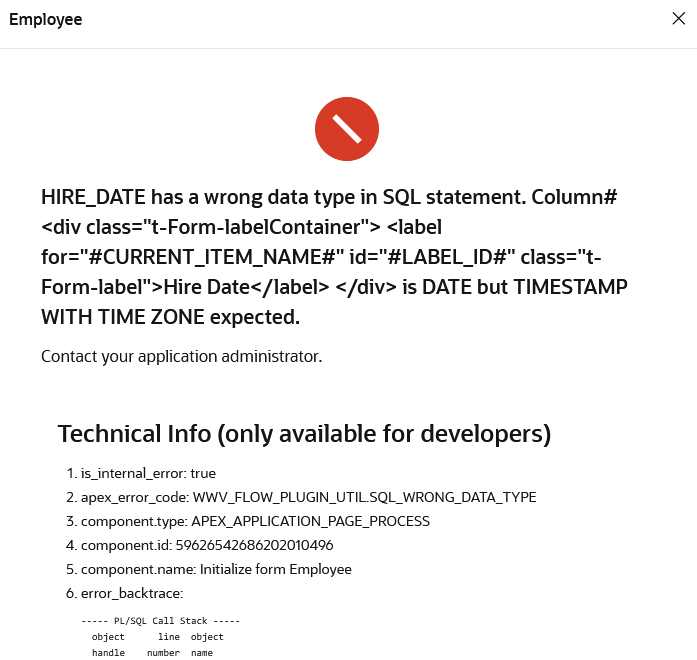
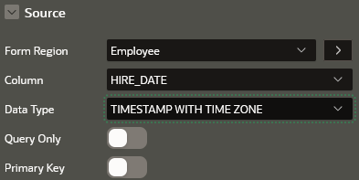
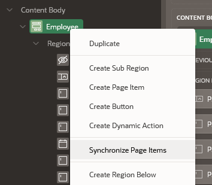
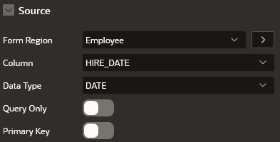
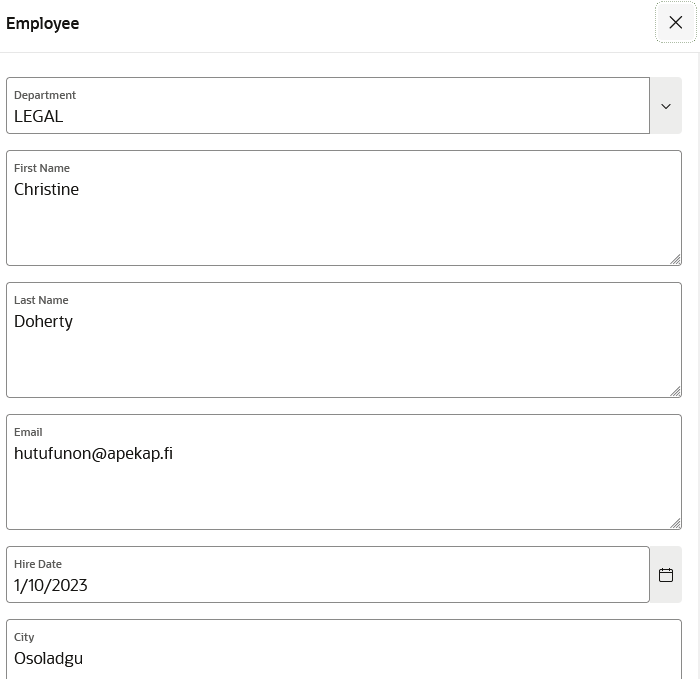

# Notas

- Criei o repositório e adicionei os ficheiros base necessários.
- Configurei o workspace e tentei executar o script QuickSQL fornecido.
- Enfrentei problemas com as datas dos registos de exemplo do sql gerado, eram gerados como números em vez de no formato de data.
- Não tenho a certeza se preciso ajustar alguma configuração no workspace ou no script QuickSQL.
- Acabei por usar o ficheiro install.sql com o SQL já gerado, que executa sem problemas.
- O script QuickSQL comentado no documento também apresenta problemas, mas o SQL pré-gerado funciona corretamente por isso vou usá-lo.
- Tentei replicar o erro conforme descrito, mas tudo funcionou sem problemas. O enunciado menciona pressionar enter após preencher os campos, mas não especifica se é o enter do teclado ou o botão de submit.
- Ao clicar no botão de 'Create' da página 5, o registo foi adicionado com sucesso.
- Segui o fluxo descrito no enunciado e tudo funcionou sem problemas, embora devesse ocorrer um erro.
- No entanto, encontrei um erro ao consultar registos já existentes, devido a um desajuste de tipos de dados. Sincronizar o Interactive Report com a base de dados resolveu o problema.

| | | | |
|-------|---------|---------|---------|
|  | Ao entrar num dos registos surge este erro. Sugere que há uma inconsistencia de dados e que o tipo da coluna Hire Date deve ser Date e não timestamp. |  | De facto surge como timestamp. |
|  | Sincronicar permite trazer o tipo correto e corrigir outras incoerências se existirem. |  | A sicronização corrigiu corretamente o tipo. |
|  | A página passou a funcionar. |

- Vou assumir que é necessário ocorrer o submit ao caregar no enter do teclado.
- Alguns page items estão como textarea, mas deviam ser text fields.
- Para além disso como os text fields permitem novas linhas e isso vai interferir com o clique no enter, vou alterar para text fields.
- Ativei a opção de 'Submit on Enter' para os text fields.
- Coloquei alguns campos como required porque apesar do modelo de dados permitir campos nulos, o formulário não deve permitir por exemplo um registo todo a null.  (tomei a liberdade de escolher alguns campos que me pareceram importantes)
